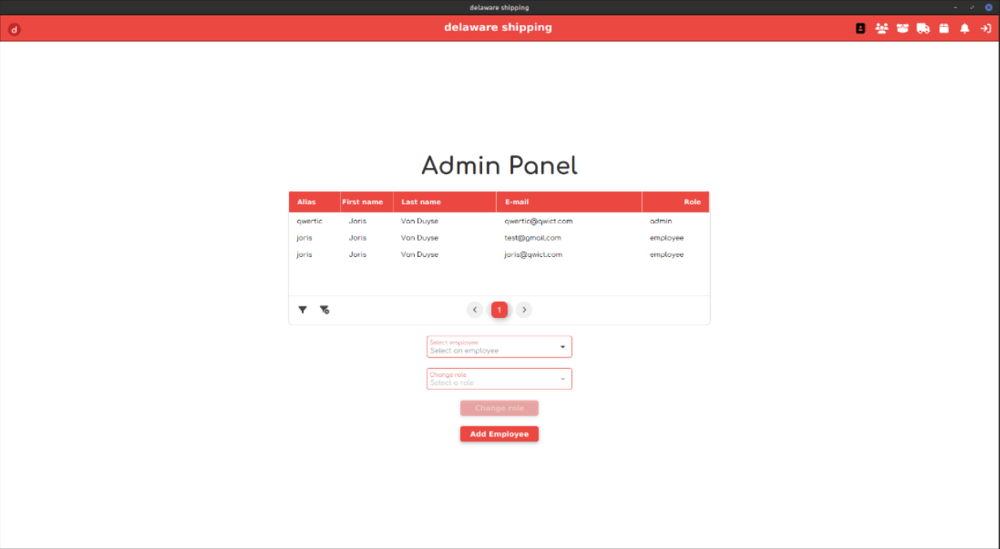

# Webshop-desktop
This is the desktop app of a webshop that was made for Delaware as a student project.

## Functionalities

Employee Management: The desktop application provides functionalities for managing employees. This includes adding, editing, and removing employees, as well as assigning specific roles and permissions.

Order Management: Employees can handle orders, including viewing order details and updating the order status.

Data: Employees have access to various well-organized data tables containing essential information.

## Images

